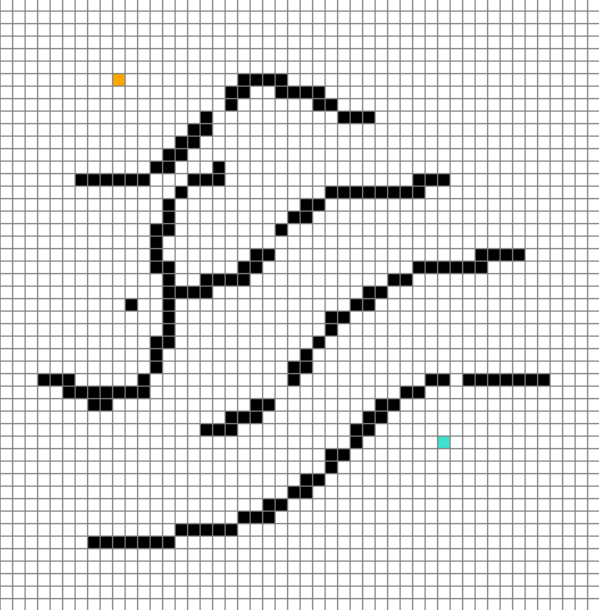
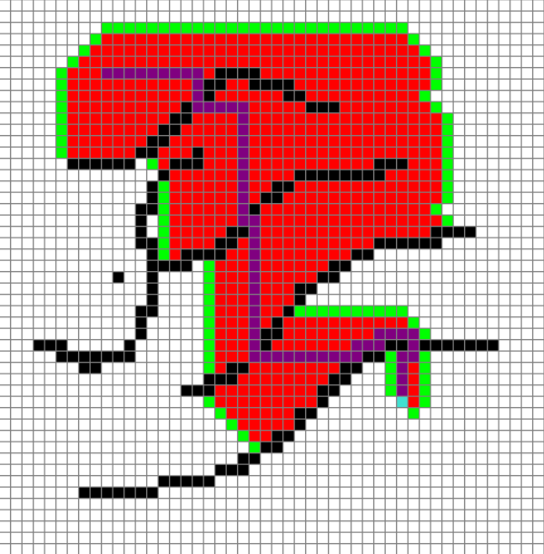

# Search heuristics (A* algorithm)

> [!IMPORTANT]
> This project is educational in nature and serves to understand the basic principles and applications of the `A*` search algorithm.

The A* (A-star) algorithm is an informed search algorithm, being an extension of Dijkstra's algorithm for finding the shortest paths from an initial node to a final node using graphs and search spaces. It uses a cost function `f(n)` that combines two components:

- __Cost g(n):__ The distance from the starting node to node n.
- __Heuristic h(n):__ An estimate of the minimum cost from node n to the goal.

The function is defined as:
```
f(n) = g(n) + h(n)
```
> [!NOTE]
> The heuristic must be admissible, i.e., it must never overestimate the actual cost to ensure that A* finds the optimal path.

## 🐍 Applications of the A* Algorithm

- __GPS navigation:__ To find optimal routes on road maps.
- __Video games:__ For character navigation and movement planning.
- __Robotics:__ For trajectory planning in complex environments.
- __AI and pattern matching:__ In artificial intelligence and pattern matching problems.

The A* algorithm is widely used due to its ability to find optimal paths efficiently, combining uniform cost search with informed heuristics to improve performance.

## 💽 Installation (Windows)

Clone this repository (ssh):
```sh
git clone git@github.com:Rizquez/AutoDocMind.git
```

Access the project directory:
```sh
cd AutoDocMind
```

Create a development environment using the **virtualenv** library:
```sh
virtualenv venv
```

If you do not have the library installed, you can run:
```sh
python -m venv env
```

Activate the development environment:
```sh
venv\Scripts\activate
```

Once the environment is activated, install the dependencies:
```sh
pip install -r requirements.txt
```

## 🛠️ Using the Project

To run the project, make sure the virtual environment is activated and execute:

```
python main.py
```
### Once the program is active, you can: 

- Indicate the start node.
- Indicate the end node.
- Indicate the barriers between the start and end nodes.
- Run the algorithm.
- Restart the program.
- Reorganize the nodes.

### This is achieved in the following way:

`Right-clicking` will indicate all nodes and barriers, the first click will be the `start node` and the second click the `end node`, the following clicks will be the barriers (if you hold down the right mouse button, the barriers will be drawn continuously).

`Left-clicking` will remove any nodes or barriers that you do not want to keep (a `start` and `end` node are required for the algorithm to run).

To run the program, press the `space bar`, and to restart it, press the `C` key.

#### Node map



#### Shortest path from the initial node to the final node



## 📂 Project structure

```
├── public/...
├── settings
│   ├── __init__.py
│   └── constants.py
├── src
│   ├── core
│   │   ├── __init__.py
│   │   └── algorithm.py
│   ├── models
│   │   ├── __init__.py
│   │   └── point.py
│   └── setup.py
├── .gitignore
├── LICENSE
├── main.py
├── README.md
└── requirements.txt
```

## 🎯 Additional considerations for developers

### Forward References (PEP 484)

The project uses *Forward References* according to *PEP 484*. By using `TYPE_CHECKING`, the import of a class is only performed at static type checking time (for example, with *mypy*). During execution, `TYPE_CHECKING` evaluates to `False`, preventing the actual import. This optimizes performance and allows forward references to classes.

Example:

```python
from typing import TYPE_CHECKING

if TYPE_CHECKING:
    from models import MyFirstClass

class MySecondClass:
    def do_something(self, first: 'MyFirstClass') -> None:
        pass
```

## 📝 Contribuciones

Contributions are welcome. If you would like to contribute to the project, please `fork` the repository, create a branch with your improvements, and send a `pull request`.

## 📖 Additional documentation

* [A* Algorithm Documentation](https://es.wikipedia.org/wiki/Algoritmo_de_b%C3%BAsqueda_A*)
* [Interactive explanation of A*](https://www.lanshor.com/pathfinding-a-estrella/)

## 🔒 License

This project is licensed under the *MIT* license, which allows its use, distribution, and modification under the conditions specified in the *LICENSE* file.

## ⚙ Contact, support, and development

- Pedro Rizquez: pedro.rizquez.94@hotmail.com
