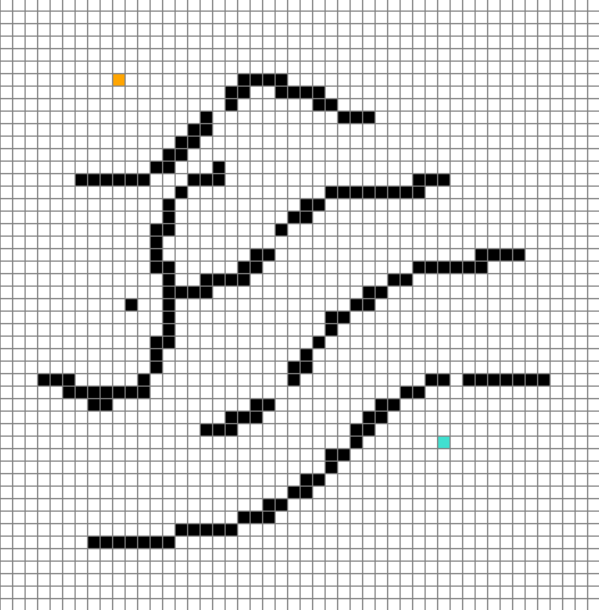

# Heuristica de busqueda (Algoritmo A*)
> [!IMPORTANT]
> Este proyecto es de caracter educativo y sirve para entender los principios y aplicaciones basicas del algoritmo de busqueda `A*`.

El algoritmo A* (A-star) es un algoritmo de busqueda informada, siendo una extension del algoritmo de Dijkstra para encontrar los caminos mas cortos desde un nodo inicial hasta un nodo final utilizando grafos y espacios de busqueda. Utiliza una funcion de coste `f(n)` que combina dos componentes:
- __Costo g(n):__ La distancia desde el nodo inicial hasta el nodo n.
- __Heuristica h(n):__ Una estimacion del coste minimo desde el nodo n hasta el objetivo.

La funcion se define como:
```
f(n) = g(n) + h(n)
```
> [!NOTE]
> La heuristica debe ser admisible, es decir, nunca debe sobreestimar el coste real para garantizar que A* encuentre el camino optimo.

## Aplicaciones del Algoritmo A*
- __Navegacion GPS:__ Para encontrar rutas optimas en mapas de carreteras.
- __Videojuegos:__ Para la navegacion de personajes y planificacion de movimientos.
- __Robotica:__ Para la planificacion de trayectorias en entornos complejos.
- __IA y busqueda de patrones:__ En problemas de inteligencia artificial y busqueda de patrones.
El algoritmo A* es ampliamente utilizado debido a su capacidad para encontrar caminos optimos de manera eficiente, combinando la busqueda de coste uniforme con heuristicas informadas para mejorar el rendimiento.

#### Mapa de nodos



#### Ruta mas corta desde el nodo inicial al nodo final


## Estructura del proyecto
```
├── src
│   ├── config
│   │   └── config.py
│   ├── models
│   │   ├── a_star.py
│   │   └── point.py
│   ├── utils
│   │   ├── drawing.py
│   │   └── geometry.py
│   └── setup.py
├── .gitignore
├── LICENSE
├── main.py
└── README.md
```

## Creacion de un entorno virtual
Se necesitara tener instalada previamente la libreria `virtualenv`, en caso contrario se podra instalar ejecutando el siguiente comando:
```
pip install virtualenv
```
Una vez instalada, para crear un entorno de desarrollo se debe ejecutar:
```
python -m virtualenv venv
```
Y para activar el entorno virtual se debe ejecutar el comando:
```
venv\Scripts\activate
```
> [!TIP]
> Se recomienda la creacion de un entorno virtual para optimizar el desarrollo y la ejecucion del proyecto.

## Dependencias
Las dependencias de este proyecto se encuentran en el fichero `requirements.txt`, las cuales se instalan mediante la ejecucion del siguiente comando:
```
pip install -r requirements.txt
```

## Uso del Proyecto
Para ejecutar el proyecto, asegurate de que el entorno virtual este activado y ejecuta:
```
python main.py
```
### Una vez activo el programa se podra: 
- Indicar el nodo de inicio.
- Indicar el nodo final.
- Indicar las barreras entre los nodos de inicio y fin.
- Ejecutar el algoritmo.
- Reiniciar el programa.
- Reorganizar los nodos.

### Esto se hace de la siguiente manera:
Con el clic `derecho` se indicaran todos los nodos y barreras, el primer clic sera el nodo de `inicio` y el segundo clic el nodo `final`, los siguientes clic seran las barreras (si se deja pulsado el clic derecho del raton se dibujaran las barreras de manera continua).

Con el clic `izquierdo` se podra ir quitando los nodos o barreras que no se deseen mantener (es necesario un nodo de `inicio` y `fin` para que el algoritmo se ejecute).

Para ejecutar se debera pulsar la tecla `espaciadora` y para reiniciar el programa se debera pulsar la tecla `c`.

## Contribuciones
Las contribuciones son bienvenidas. Si deseas contribuir al proyecto, por favor haz un `fork` del repositorio, crea una rama con tus mejoras y envía un `pull request`.

## Licencia
Este proyecto está bajo una licencia MIT. Consulta el archivo `LICENSE` para más detalles.

## Recursos adicionales
* [Documentacion del Algoritmo A*](https://es.wikipedia.org/wiki/Algoritmo_de_b%C3%BAsqueda_A*)
* [Explicacion interactiva de A*](https://www.lanshor.com/pathfinding-a-estrella/)